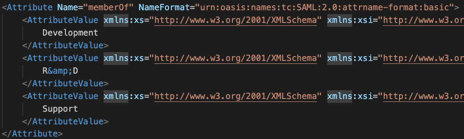

# Identity Groups Sync Mattermost Plugin

This plugin synchronizes user groups from Keycloak to Mattermost.

## License

This repository is licensed under the [Mattermost Source Available License](LICENSE) and requires a valid Enterprise Edition License when used for production. See [frequently asked questions](https://docs.mattermost.com/overview/faq.html#mattermost-source-available-license) to learn more.

Although a valid Mattermost Enterprise Edition License is required if using this plugin in production, the [Mattermost Source Available License](LICENSE) allows you to compile and test this plugin in development and testing environments without a Mattermost Enterprise Edition License. As such, we welcome community contributions to this plugin.

If you're running an Enterprise Edition of Mattermost and don't already have a valid license, you can obtain a trial license from **System Console > Edition and License**. If you're running the Team Edition of Mattermost, including when you run the server directly from source, you may instead configure your server to enable both testing (`ServiceSettings.EnableTesting`) and developer mode (`ServiceSettings.EnableDeveloper`). These settings are not recommended in production environments.

## Features

- Sync Keycloak groups with Mattermost.
- Sync groups with teams or channels.
- Assign Mattermost group memberships to user's on sign in through SAML based on the Group memberships in their SAML assertion.

## Development guide

1. Run Keycloak locally with Mattermost by adding it to your `ENABLED_DOCKER_SERVICES`, see our SAML setup guide [here](https://github.com/mattermost/mattermost/blob/master/server/build/docker/keycloak/README.md).
2. Follow our plugin setup guide [./docs/INSTALL.md](./docs/INSTALL.md).

## Installation

Check out our guide in [./docs/INSTALL.md](./docs/INSTALL.md).

## FAQ

### What is a group synced channel or team?

In the installation documentation we walked through setting up your first synchronization which covers it at a high level. There is more information about Group sync with LDAP in Mattermost [here](https://docs.mattermost.com/onboard/ad-ldap-groups-synchronization.html). Those docs apply to LDAP but this plugin uses all the same synchronization features as LDAP groups.

### I linked a group, synced it to a channel but the Keycloak group members were not automatically added to the channel?

If you newly link a Keycloak group to Mattermost that has not been linked before, group members will need sign out and sign back in to be added to the group, channels and teams. This is because we only sync a user's group memberships with existing Mattermost groups on login. If a group is already synced to Mattermost and you add/remove the group from a channel, user's channel membership will automatically update.

### I'm unable to add a group to a channel of a group synced team?

If a team is group synced and you want to group sync a channel within the team, the group assigned to the channel must also be synced to the team.

## Keycloak limitations 

### Keycloak group names in SAML assertion

The SAML assertion for group memberships contains the name of the group, not the group ID.  

This is a limitation in Keycloak, they do not support passing a group ID as an attribute value. In Mattermost we reference the Keycloak group by storing the Keycloak group ID in the UserGroups table, not by storing the group name. This is because the Keycloak group ID is immutable but groups can be renamed. 

When the user logs in we have a list of keycloak group names from the SAML assertion, our UserGroups table contains the group ID. To match up SAML assertion groups to the Mattermost groups we keep a map of your Keycloak groups where the key is the Keycloak group name, and the value is the Keycloak group ID. This map is updated every hour by a job that runs in the background. If a user logs in with a new group before this job picks it up, we reach out to the keycloak server through `GET /group-by-path/{group-name}` and pull in the group information. The map saves us having to reach out to keycloak for each individual group that is in the SAML assertion. 

The only limitation with keeping this map is that if 2 groups swap names with eachother and someone logs in before the background job runs, they will end up in the wrong groups. While this is an edge case that is unlikely to happen, you should be aware. 

### Group memberships from Keycloak are only synced on login

This was the requirements when creating the plugin. The code can be easily updated to include a job in order to sync these on a schedule.
