# How To Install

Download the latest released version and upload to your Mattermost installation on the plugins page of the System Console in the usual way.

## How To Configure

### Prerequisites

1. Setup SAML login with Keycloak, see our guide [here](https://docs.mattermost.com/onboard/sso-saml-keycloak.html). 
2. Create groups or roles in your Keycloak realm:
   - For **groups mapping**: Create groups, see the official documentation [here](https://www.keycloak.org/docs/latest/server_admin/index.html#proc-managing-groups_server_administration_guide).
   - For **roles mapping**: Create realm roles, see the official documentation [here](https://www.keycloak.org/docs/latest/server_admin/index.html#proc-creating-realm-roles_server_administration_guide).

### Keycloak Setup

This guide will break down the setup into 4 easy stages:
1. [Keycloak service account setup](#keycloak-service-account-setup)
2. [Mattermost plugin configuration](#mattermost-plugin-configuration)
3. [Keycloak group/role membership attribute](#keycloak-grouprole-membership-attribute)
4. [Mattermost group link and syncables setup](#mattermost-group-link-and-syncables-setup)

### Keycloak service account setup

In addition to setting up SAML login, you will also need to configure a service account for the plugin to use. You will need to create this client in the same realm as your SAML login client.

1. Navigate to your realm and click **Create Client**.
2. Configure the following values for step 1:
```
Client type: OpenID Connect
Client ID:   mattermost-admin
```
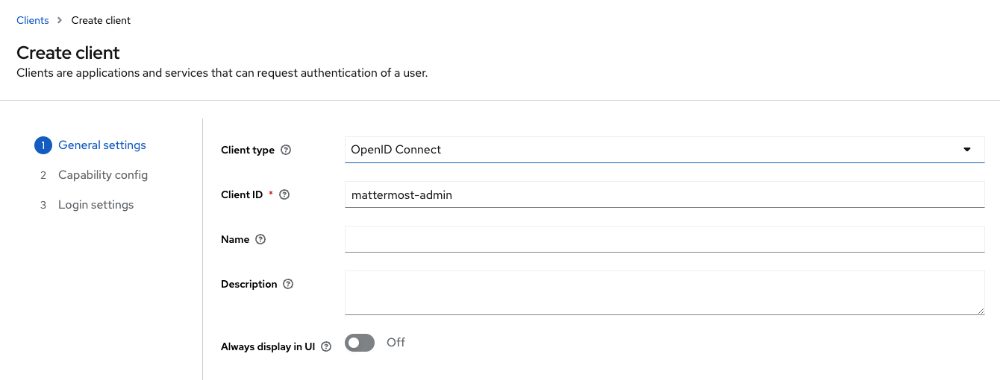

3. Click **Next** and configure the following values: 
```
Client authentication: Enabled
Service account roles: Enabled
```
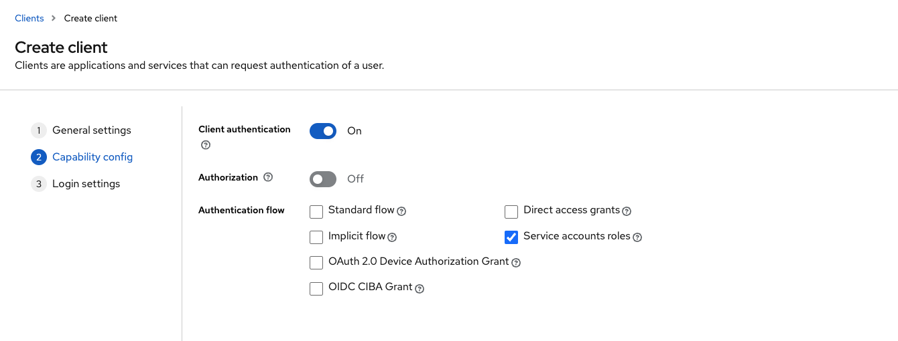

4. Disable the other configurations, click **Next** and then **Save**.
5. The client is now created but we need to assign a role to the service account so it can view the groups/roles in our realm. Navigate to **Service account roles**.
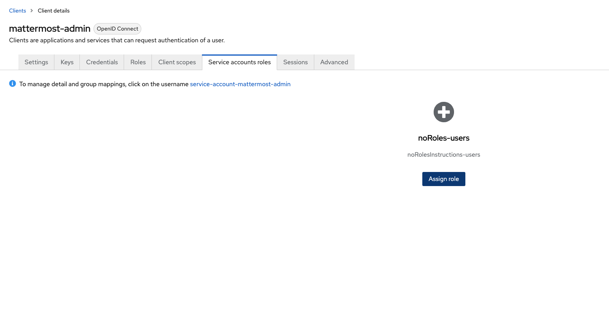

6. Click **Assign role**, and in the modal, click the drop-down that says **Filter by realm roles** and click **Filter by clients**.
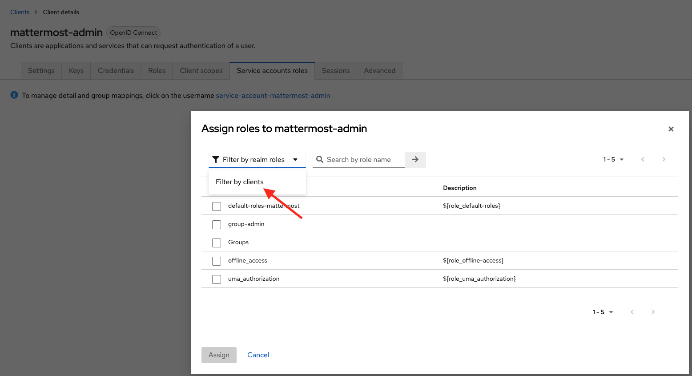

7. A new list of roles will appear. Assign the appropriate role based on your mapping type:
   - **For groups mapping**: Select **manage-users** and click **Assign**. This grants permissions to access Keycloak groups.
   - **For roles mapping**: Select **view-realm** and click **Assign**. This grants permissions to access Keycloak realm roles.
   
   These are the minimum roles the plugin needs to operate for each mapping type.
8. Navigate to the **Advanced** section to enable refresh tokens. This is not necessary but will be helpful for troubleshooting when configuring the plugin because this allows service account sessions to be revoked directly from Keycloak.
9. Scroll to the **Open ID Connect Compatibility Modes** section and enable the following values:
```
Use refresh tokens for client credentials grant: Enabled
```
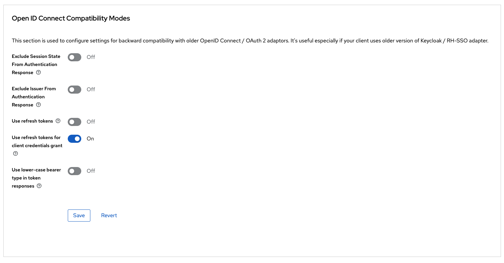

10. Click **Save** on that section.
11. Scroll down to the **Advanced settings** section.
12. Set the **Access Token Lifespan** value to hours or days. This is not necessary but it means less calls to the authenticate endpoint.
13. Click **Save** on that section.
14. Click the credentials tab and set **Client authenticator** to **Client Id and Secret**.
15. Regenerate and copy the **Client Secret**.

### Mattermost plugin configuration

In this step we will configure the Identity groups sync plugin configurations and view your Keycloak groups or roles inside Mattermost.

1. In the Mattermost System Console, go to **Identity Groups Sync** in the **PLUGINS** section.
2. Configure the following values:
```
Groups Provider:        Keycloak
At Rest Encryption Key: <Click regenerate>
Keycloak Host URL:      <Your keycloak hostname>
Keycloak Realm:         <Your keycloak realm>
Client ID:              mattermost-admin
Client Secret:          <Paste the value from step 15 of Keycloak service account setup>
Keycloak Mapping Type:  groups (or roles if using roles mapping)
Groups Attribute:       memberOf
```
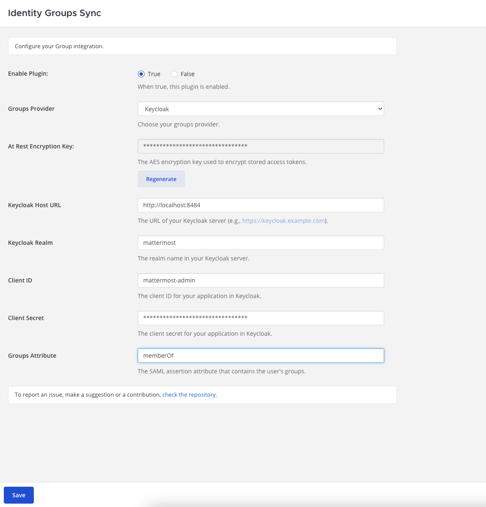

**Note**: The **Keycloak Mapping Type** determines whether the plugin syncs Keycloak groups or realm roles:
- **groups** (default): Syncs Keycloak groups with Mattermost groups
- **roles**: Syncs Keycloak realm roles with Mattermost groups

3. Click **Save**. At this stage, your plugin is configured to view Keycloak groups or roles inside the Mattermost System Console. The next steps will confirm this.
4. In the System Console, go to the **Groups** page.
5. Confirm there is a section that says **Keycloak Groups** and that you can see a list of your Keycloak groups or roles. If you cannot see your Keycloak entities inside Mattermost, skip to the troubleshooting section.
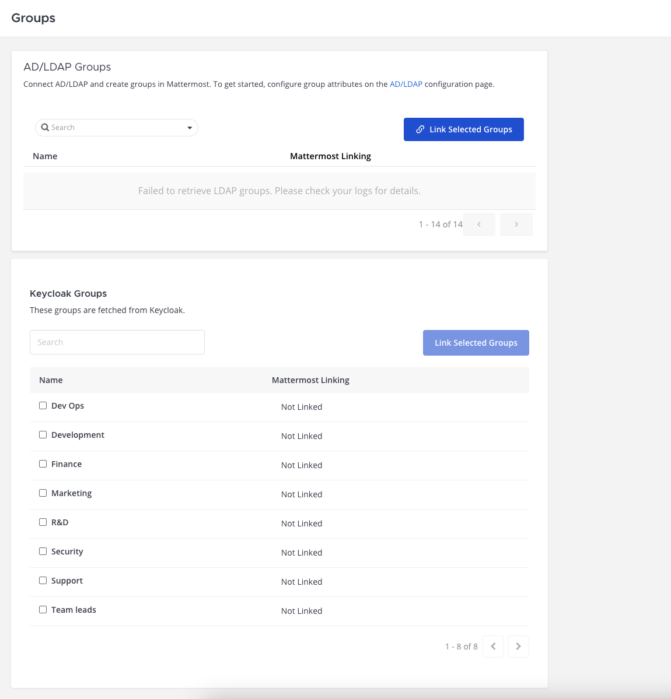
6. In Keycloak, you can **disable** the **Use refresh tokens for client credentials grant** configuration if preferred. We have confirmed the correct role setting has been granted. Keycloak says the following about Refresh tokens for client credential grants:
```
The OAuth 2.0 RFC6749 Section 4.4.3 states that a refresh_token should not be generated when client_credentials grant is used. If this is off then no refresh_token will be generated and the associated user session will be removed.
```

### Keycloak group/role membership attribute

In order for a user's group or role memberships to sync with Mattermost, they need to be included in the SAML attributes when they login.

#### For Groups Mapping

1. In Keycloak, navigate to your Mattermost SAML client.
2. Click **Client scopes**.
3. Click **mattermost-dedicated**.
4. Click **Add mapper** and then click **By configuration**.
5. Click **Group list** as your configured mapper.
6. Configure your group mapper with the following values:
```
Name:                       GroupList
Group attribute name:       memberOf
Friendly name:
SAML Attribute Name Format: Basic
Single Group Attribute:     Enabled
Full group path:            Disabled
```

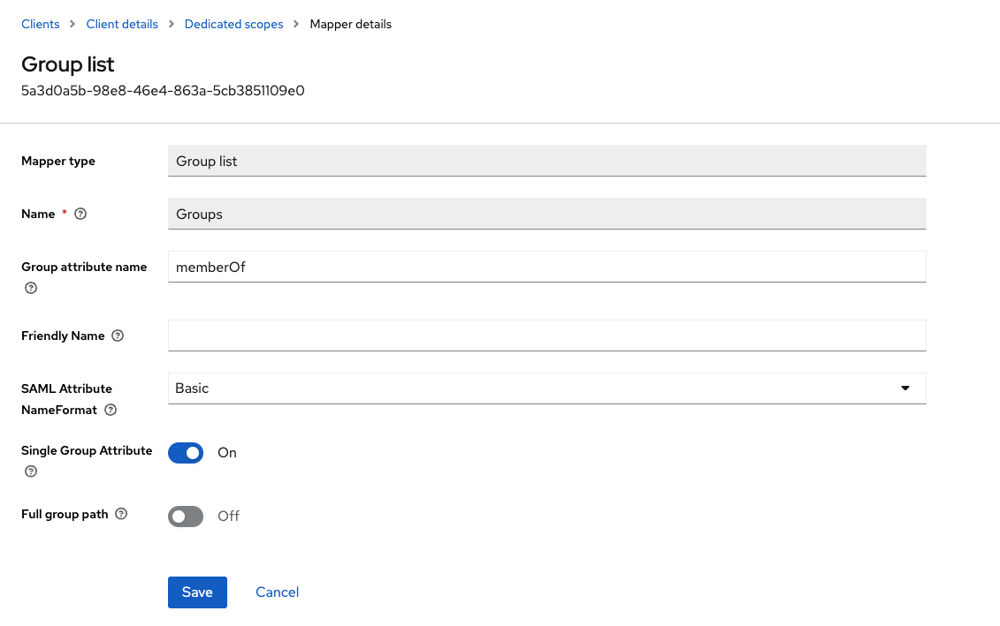

7. Click **Save**.

#### For Roles Mapping

1. In Keycloak, navigate to your Mattermost SAML client.
2. Click **Client scopes**.
3. Click **mattermost-dedicated**.
4. Click **Add mapper** and then click **By configuration**.
5. Click **Role list** as your configured mapper.
6. Configure your role mapper with the following values:
```
Name:                       RoleList
Role attribute name:        memberOf
Friendly name:
SAML Attribute Name Format: Basic
Single Role Attribute:      Enabled
```

7. Click **Save**.

**Important**: The attribute name (Group attribute name or Role attribute name) needs to match the **Groups Attribute** value you set in your plugin configurations in Mattermost.

### Mattermost group link and syncables setup

In this step we will link a Keycloak group or role to Mattermost, assign it to a channel, and sign in as a SAML user.

1. In the System Console, go to the **Groups** section.
2. Select a group from your Keycloak groups/roles list and click **Link Selected Group**. This creates a **UserGroup** record in the Mattermost database.
3. Now we need to link this group to a channel. In the System Console, go to **Channels**.
4. Select the channel you want to assign the group to.
5. In order to make a channel only accessible to assigned groups, you need to enable **Sync Group Members**. This will change the channel to private and remove any non-group members from the channel.

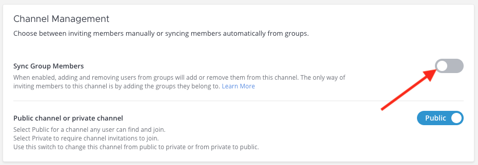

6. Click the **Add Group** button and select your group from the list.
7. Click **Save**.
8. Now in order for the group/role member to be assigned to that group and channel, they will need to sign in to Mattermost. If you are the user who is a member of that group/role, you will need to sign out and sign back in.
9. Once you have signed in, you should be able to access that channel.

Assigning groups to teams is the same process outlined above.

## Troubleshooting

### The Keycloak groups/roles list is showing an error

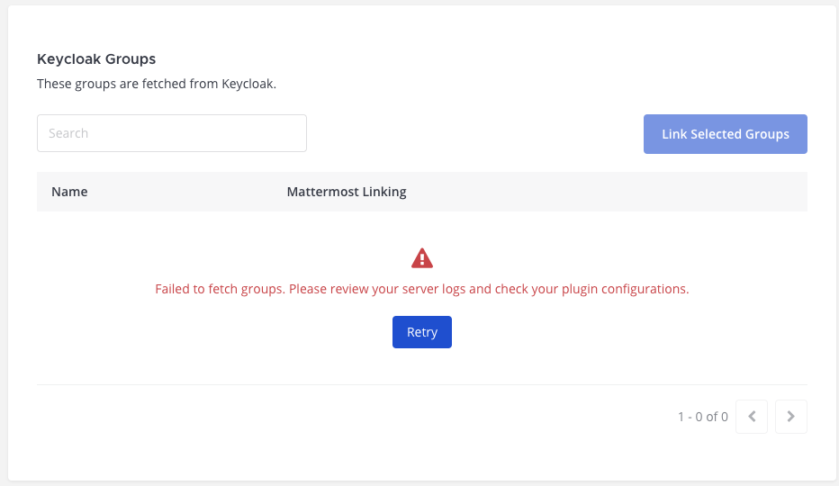

Check the logs for further details and review your Keycloak plugin configs to ensure the Host, Realm, Client ID, Client Secret, and Mapping Type are correct.

The following logs indicate an issue with your Client ID or Client Secret:
```
{"timestamp":"2025-04-09 14:15:49.465 -04:00","level":"error","msg":"Failed to fetch groups","caller":"app/plugin_api.go:1112","plugin_id":"com.mattermost.plugin-identity-groups-sync","error":"failed to get groups: failed to get auth token: authentication error: failed to authenticate client: 401 Unauthorized: unauthorized_client: Invalid client or Invalid client credentials"}
{"timestamp":"2025-04-09 14:15:49.941 -04:00","level":"error","msg":"Failed to fetch groups count","caller":"app/plugin_api.go:1112","plugin_id":"com.mattermost.plugin-identity-groups-sync","error":"failed to get groups count: failed to get auth token: authentication error: failed to authenticate client: 401 Unauthorized: unauthorized_client: Invalid client or Invalid client credentials"}
```

The following logs indicate a permission issue and your service account may not have the correct role applied:
```
{"timestamp":"2025-04-09 14:22:11.841 -04:00","level":"error","msg":"Failed to fetch groups","caller":"app/plugin_api.go:1112","plugin_id":"com.mattermost.plugin-identity-groups-sync","error":"failed to get groups: operation failed after reauthentication: 403 Forbidden: unknown_error"}
{"timestamp":"2025-04-09 14:22:12.333 -04:00","level":"error","msg":"Failed to fetch groups count","caller":"app/plugin_api.go:1112","plugin_id":"com.mattermost.plugin-identity-groups-sync","error":"failed to get groups count: could not get groups count: 403 Forbidden: unknown_error"}
```

If you applied the incorrect role to your service account user, you will need to revoke the service account session in order for your service account to pick up the newly applied role. Remember the correct roles are:
- **manage-users** for groups mapping
- **view-realm** for roles mapping
In order to revoke a Keycloak session inside Keycloak, you would need to have **Use refresh tokens for client credentials grant** enabled.
1. Apply the correct role to the **mattermost-admin** client:
   - **manage-users** for groups mapping
   - **view-realm** for roles mapping
2. Navigate to **Sessions** in the **mattermost-admin** client.
3. Click the 3 dots on the right and sign out.
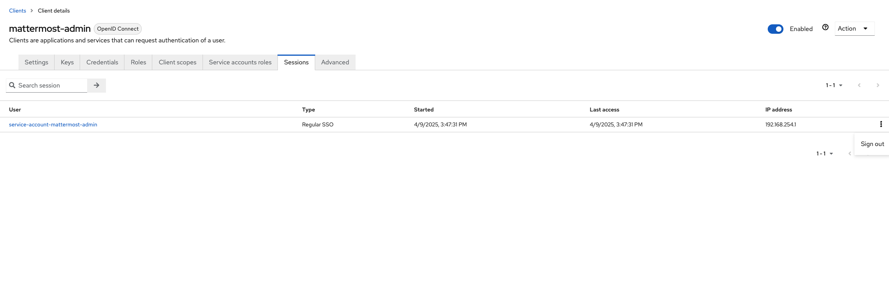

If you don't see the session inside Keycloak, you can destroy the session Mattermost has stored by updating the Plugin configurations in the Mattermost System Console and clicking **Save**.

### My SAML user is not being added to their groups inside Mattermost when logging in

The first step is to check the logs for any errors. Enabling debug logging in Mattermost will log the assertion info which you can use to check which attributes Mattermost received. You can use that to verify the Groups attribute is present in your SAML attributes.

Another option to check your SAML attributes is [this](https://docs.mattermost.com/onboard/sso-saml-technical.html#how-can-i-troubleshoot-the-saml-logon-process).

Ensure the System Console **Groups Attribute** value matches up with the attribute assigned in the Keycloak SAML client attributes. As per the setup instructions for [Keycloak group/role membership attribute](#keycloak-grouprole-membership-attribute):
- For groups mapping: ensure **Single Group Attribute** is **enabled** and **Full group path** is **disabled**
- For roles mapping: ensure **Single Role Attribute** is **enabled**

Also verify that your **Keycloak Mapping Type** setting matches the type of SAML mapper you configured (groups or roles).
